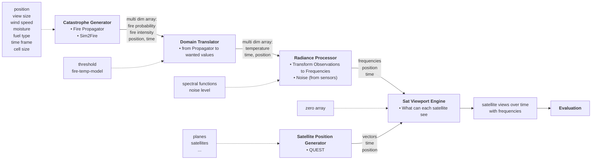

# Data Generation Architecture
 
Dashed arrows = inputs/parameters. Solid arrows = data flow (label = what is passed on).
 

```mermaid
flowchart LR
    %% ---------- Inputs ----------
    in1["position<br/>view size<br/>wind speed<br/>moisture<br/>fuel type<br/>time frame<br/>cell size"]
    in2["threshold<br/>fire-temp-model"]
    in3["spectral functions<br/>noise level"]
    in4["zero array"]
    in5["planes<br/>satellites<br/>..."]
 
    %% ---------- Stages ----------
    gen["<b>Catastrophe Generator</b><br/>• Fire Propagator<br/>• Sim2Fire"]
    pre["<b>Domain Translator</b><br/>• from Propagator to wanted values"]
    proc["<b>Radiance Processor</b><br/>• Transform Observations to Frequencies<br/>• Noise (from sensors)"]
    view["<b>Sat Viewport Engine</b><br/>• What can each satellite see"]
    quest["<b>Satellite Position Generator</b><br/>• QUEST"]
    eval["<b>Evaluation</b>"]
 
    out["satellite views over time<br/>with frequencies"]
 
    %% ---------- Flow ----------
    in1 -.-> gen
    gen -->|"multi dim array:<br/>fire probability<br/>fire intensity<br/>position, time"| pre
    in2 -.-> pre
    pre -->|"multi dim array:<br/>temperature<br/>time, position"| proc
    in3 -.-> proc
    proc -->|"frequencies<br/>position<br/>time"| view
    in4 -.-> view
    in5 -.-> quest
    quest -->|"vectors<br/>time<br/>position"| view
    view --> out
    out --> eval
```
 
